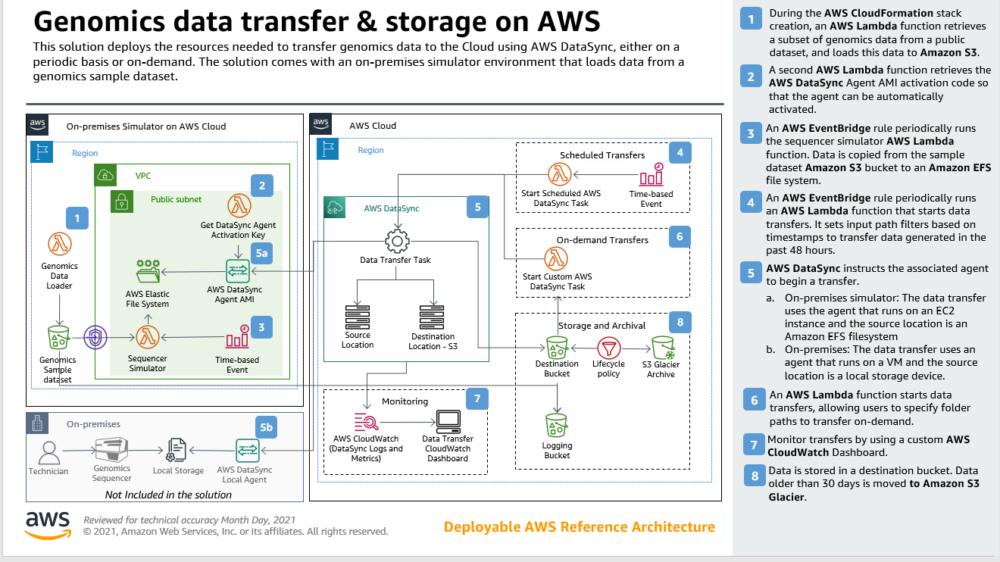

# Genomics Data Transfer and Storage on AWS

## Introduction
Genomics data is expanding at a rate exceeding Moore’s law. As more sequencing data is produced, and customers move from genotyping to whole genome sequencing, the amount of data produced is outpacing on-prem capacity – customers need cloud solutions for data transfer, storage and management, and downstream scientific analysis. The volume of data
being generated by genomics sequencing laboratories makes data transfer to the cloud a principal challenge for genomics customers.

In this prototype, we create a robust, scalable, and secure solution for data transfer from genomics sequencers on-premises to object storage in Amazon S3 using AWS DataSync and AWS Lambda.

By simulating an on-premises environment, we demonstrate how to transfer genomics data files to Amazon S3 as they are written to Network Attached Storage (NAS) on-premises and how to life cycle genomics data to archival storage using Amazon Glacier Deep Archive.
## Reference Architecture



## 📋 Table of contents

 - [Metrics](#metrics)
 - [Pre-requisites](#pre-requisites)
 - [Deployment](#deployment)
 - [Usage](#usage)
 - [Cleanup](#cleanup)
 - [Security](#security)
 - [License](#license)

## Metrics

The below metrics show approximate values associated with deploying and using this solution:

Metric | Value
------ | ------
**Asset Type** | Prototype
**Installation Time** | 15 minutes
**Audience** | Developers, Solutions Architects

## Pre-requisites

- This repository cloned in your local computer
- An AWS Account
- An S3 bucket created in the same AWS Account and region where you'll deploy the solution. This will be used to store AWS SAM Artifacts.
- An EC2 key pair created, preferably named GenomicsDatasyncTransfer, in the same AWS account and region where you'll deploy the solution.
- AWS CLI and profile is configured for the account you want to deploy into. Instructions can be found [here](https://docs.aws.amazon.com/cli/latest/userguide/cli-chap-install.html).
- Python 3.9 must be installed.
- Install git-remote-codecommit (e.g ```pip install git-remote-codecommit```)
- Install boto3 (e.g ```pip install boto3```)
- Install aws-sam-cli (e.g. ```pip install aws-sam-cli```)

## Deployment

In order to run this demo: 
- Go to the main folder where the repository was cloned, then switch into the _deployment/_ directory
- Open the _cloudformation.yml_ file. Update the following parameters of the stack to match your environment:
    - _OnPremisesSimulatorVpcDefaultAZ_: Update the Default AZ for the On-premises Simulator VPC
    - _DataSyncAgentInstanceType_: Select the instance type to be used for the AWS DataSync Agent. Use m5.2xlarge for tasks <= 20 million files, m5.4xlarge for tasks > 20 million files.
    - _DataSyncAgentKey_: If you decide to use a different name for the EC2 key pair that’s listed in the pre-requisites section, then you’ll need to update this parameter.

- Run the _deploy.sh_ script, it takes two parameters:

    ```bash
    $ . ./deploy.sh <Artifacts Bucket Name (see pre-requisites)> <Desired CloudFormation Stack Name>
    ```

The deployment script uses AWS SAM to build and package the solution, and then it starts the deployment of an AWS CloudFormation stack.

## Usage

### Running the demo

Once the AWS CloudFormation stack is created; To begin the data transfer you need to go to the AWS EventBridge console, and enable the rules named _SequencerSimulatorTaskTriggerEvent_, and _DataSyncTaskTriggerEvent_. The rules are disabled to minimize the chance of users accidentally leaving the demo on and getting charged.

The _SequencerSimulatorTaskTriggerEvent_ rule pulls data from the genomics sample dataset Amazon S3 bucket and loads it on to the EFS file system on the on-premises simulator, this is used to simulate a genomics sequencers loading data into local storage.

The _DataSyncTaskTriggerEvent_ rule calls the _StartDataSyncTask_ AWS Lambda function at 15 minutes intervals. The function takes the ARN of the AWS DataSync task named _EFSToS3DataSyncTask_, which was created by the AWS CloudFormation template, along with the list of paths passed in the _SequencerOutputPaths_ parameter. By default, the function will create input filters covering 72 hours (3 days), if there is a need to cover runs that may span more than 3 days, then the TRANSFER_DAYS variable needs to be updated.

About 15 minutes after the AWS EventBridge rules are enabled, you should see new AWS DataSync task executions running. You can view them on the AWS DataSync console by clicking on the task and looking under the history tab. In this tab you’ll see all the execution history and can view the status of each execution and the task itself. Once a task is completed, you'll also be able to view the files in your S3 _DestinationBucket_. 

Lastly, you can monitor the status and results of the AWS DataSync task executions overall by looking at the Genomics-Data-Transfer-Monitoring dashboard. You can find that under dashboards in the AWS CloudWatch console.

#### Custom AWS DataSync executions
There might be occasions where you might need to trigger one-off or ad hoc uploads. This might be because a previous upload failed, a genomics sequencer ran for an extended period of time not covered by the default scheduled execution, or something was misconfigured, a network outage occurred, etc. For these cases, ad hoc runs can be triggered, you just need to upload a text file containing a list of absolute paths to upload.

This text file needs to be uploaded to the /adhoc directory. Note the directory is at the root level of either the on-premises simulator AWS Elastic File system, or your local on-premises storage device. The text file can have any name you want, and can  contain many paths, each one in a separate line. For example:

```bash
/efs/sequencers/incoming/oneoffsequencer/20210921_bffd9c06-aac9-41ea-adbe-10fd0ebb4c38/*
/efs/sequencers/incoming/iseq/20210921_2gre4c06-aac9-41ea-adbe-10fd0ecc3f21/*
```

On the next scheduled AWS DataSync task execution, the text file will be transferred to the S3 Destination Bucket, the bucket is configured to detect object create events on the adhoc prefix. Once the event is detected, the AdhocDataSyncTaskFunction AWS Lambda function is triggered. This function will read each line from the text file, and trigger a custom DataSync task execution, using these paths as input filters.

This feature allows non-technical users to trigger resyncs without needing to understand a command line or log into the AWS console.

## Cleanup

To avoid incurring future charges, delete the solution by deleting the stack on the AWS CloudFormation console.

After testing the solution, the following Amazon S3 buckets will not be automatically deleted, you’ll need to manually remove them:
- Logging Bucket - _LoggingBucket_
- Genomics sample dataset bucket – _GenomicsSampleDatasetBucket_
- Destination Bucket - _DestinationBucket_

## Security

See [CONTRIBUTING](CONTRIBUTING.md#security-issue-notifications) for more information.

## License

This application is licensed under the MIT-0 License. See the [LICENSE](LICENSE) file.
